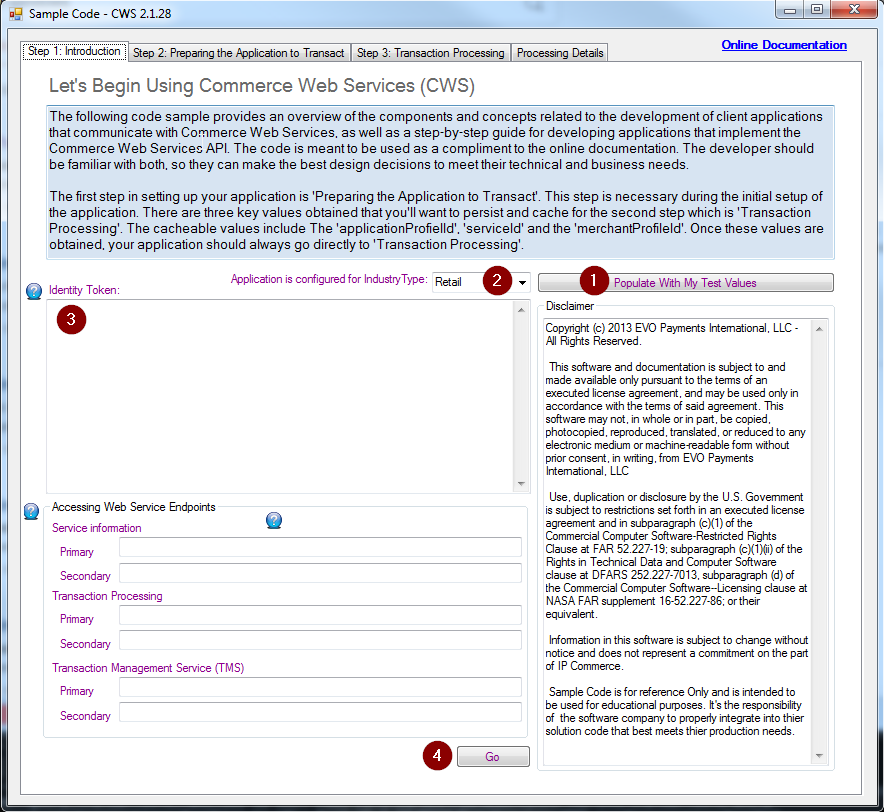

 
# EVO Snap* Visual Basic.NET Card Present Rest Sample Application

This application is sample code demonstrating how to integrate with Evo Snap*'s
Commerce Web Services with Windows Communication Foundation.

**Got a question?**  Visit http://www.evosnap.com/support/ for development help.  

Integration Guidelines available here:  http://www.evosnap.com/support/knowledgebase/

To request personalized test credentials visit: http://www.evosnap.com/request-certification-credentials/

## Talk to your Solutions Consultant before attempting to run this software.

This software depends on contacting the Snap* API for all functionality, so you
will need to obtain an IdentityToken from your Solutions Consultant in order to
run this project successfully.

**This project was created in Visual Studio 2010.  You may need to update the project if you are using a more recent version of Visual Studio.**

### Set Up

1. Edit the app.config file and enter the IdentityToken given to you by your Solutions Consultant.
2. The Endpoint Management section of the app.config file define the endpoints the application will use. 	Be sure these are set to the version of CWS you are connecting to.

### How To Use

Build the project in Visual Studio, then run the resulting .exe file.  You will see:

1. Your solutions consultant has pre-loaded configuration details which will
   point you to the most recent version of the CWS endpoint.  Clicking this
   button will set you up.
2. By default the application is set to run in Retail mode.  If your Solutions
   Consultant has configured you for a different Industry Type (MOTO, Ecommerce,
   or Restaurant) you will need to select this here.
3. Your Identity Token, as provided by your Solutions Consultant, should be
   placed here.
4. Click "Go" to prepare to transact.

The Step 2 tab provides you with a GUI to step through the "Preparing to
Transact" procedure your application will follow when making calls against CWS.

For more details on each step, see our documentation here:
http://docs.evosnap.com/commerce-web-services/cws-preparing-the-app-to-transact/

1. Click "Sign On With Token".  This uses the Identity Token provided in Step 1
   to create a Session Token which is used on all subsequent calls against CWS.
2. You'll need the Application ID provided to you by your Solutions Consultant
   for this step; click the button and a popup will appear.  You'll need to
   put your Application ID into the "Application Profile ID" box.  This form
   allows you to manage the configuration details specific to your application.
   You can click "Populate With Test Values" to fill in a few sample values.  If
   you require assistance in configuring your application, contact your
   Solutions Consultant.  Once you are done, select "Save Application Data" and
   click "Perform Web Request."  You can then close this window.  Once you've
   saved application data, you can use the "Get Application Data" action to
   fetch the details instead of entering them again.
3. Clicking "Retrieving Service Information" fetches the pre-configured
   services, workflows (if necessary), and profiles available for your
   application.
4. Drop down the available services and select the appropriate service for your
   application.
5. Details about your selected application will be displayed here.
6. Your application can have multiple Merchant Profiles.  These profiles contain
   information about the specific merchant that transactions can be run through.
   These Merchant Profiles contain information such as the merchant's name,
   address, details about their specific transactions, etc.  You can have
   multiple merchant profiles, and all are managed with the "Manage Merchant
   Data" button.  Use "Get Merchant Profiles" to fill the dropdown box with
   your configured merchants.  You can replace the contents of the "Available
   Profile(s)" combobox with a new identifier to create a new profile.  Once the
   tabs are filled with the appropriate data, use the "Save Merchant Profile"
   action to push it to CWS.

Once you've completed all the steps, you are now ready to transact with CWS.
Click the "Step 3: Transaction Processing" tab to make transactions.  You can
edit the details that the transaction buttons use with the "Processing Details"
tab.

The buttons on this page all exactly mirror the functionality of the CWS API
directly.  There are a couple of things to be aware of, however.

Some features, such as Undo() VOID, Capture(), and ReturnById() require you to
"pass in" transaction IDs upon which these functions should be run.  To select
the transactions you want to run these functions against, tick the appropriate
checkboxes next to the transactions in the box labeled "1" on the screenshot.

The checkbox labeled "2" on the screenshot allows you to pull up more complete
details about any individual transaction.  If this box is ticked and you click
on a transaction, a popup window will appear with all the recorded details from
CWS related to that transaction.

If you have any questions about how all this works, please feel free to contact
your Solutions Consultant.

## Understanding The Application

Applications utilizing the Snap* platform follow a series of steps:

* Connection Setup
  - Fetch a Session Token based on the Identity Token
	- Optional:  Cache the Session Token for use by future commands
* Application Setup
  - Fetch Application Profile
	- Fetch Service Information
	- Fetch Merchant Profile
* Optional:  make a series of transactions
* Optional:  make a series of queries to TMS

Snap*'s Commerce Web Services utilizes Datacontracts for WCF, making
integration with .NET applications a breeze.  Details about the HTTP connections
to CWS can be seein in app.config.

## Example Industry Configuration Details For app.config

* Ecommerce
  - TxnData_IndustryType = 'Ecommerce'
  - TxnData_CustomerPresent = 'Ecommerce'
  - ApplicationAttended = false;
  - ApplicationLocation = 'OffPremises'
  - PINCapability = 'PINNotSupported'
  - ReadCapability = 'KeyOnly'
  - EntryMode = 'Keyed'

* MOTO (Mail Order-Telephone Order)
  - TxnData_IndustryType = 'MOTO'
  - TxnData_CustomerPresent = 'MOTO'
  - ApplicationAttended = false;
  - ApplicationLocation = 'OffPremises'
  - PINCapability = 'PINNotSupported'
  - ReadCapability = 'KeyOnly'
  - EntryMode = 'Keyed'

* Retail
  - TxnData_IndustryType = 'Retail'
  - TxnData_CustomerPresent = 'Present'
  - ApplicationAttended = true;
  - ApplicationLocation = 'OnPremises'
  - PINCapability = 'PINNotSupported'
  - ReadCapability = 'HasMSR'
  - EntryMode = 'TrackDataFromMSR'

* Restaurant
  - TxnData_IndustryType = 'Restaurant'
  - TxnData_CustomerPresent = 'Present'
  - ApplicationAttended = true;
  - ApplicationLocation = 'OffPremises'
  - PINCapability = 'PINNotSupported'
  - ReadCapability = 'HasMSR'
  - EntryMode = 'TrackDataFromMSR'

## License

 - Copyright: 2018 EVO Payments International - All Rights Reserved

This software and documentation is subject to and made available only pursuant to the terms of an executed license agreement, and may be used only in accordance with the terms of said agreement. This software may not, in whole or in part, be copied, photocopied, reproduced, translated, or reduced to
any electronic medium or machine-readable form without prior consent, in writing, from EVO Payments International, INC.

Use, duplication or disclosure by the U.S. Government is subject to restrictions set forth in an executed license agreement and in subparagraph (c)(1) of the Commercial Computer Software-Restricted Rights Clause at FAR 52.227-19; subparagraph (c)(1)(ii) of the Rights in Technical Data and Computer Software clause at DFARS 252.227-7013, subparagraph (d) of the Commercial Computer Software--Licensing clause at NASA FAR supplement 16-52.227-86; or their equivalent.

Information in this software is subject to change without notice and does not represent a commitment on the part of EVO Payments International.

Sample Code is for reference Only and is intended to be used for educational purposes. It's the responsibility of the software company to properly integrate into thier solution code that best meets thier production needs.
